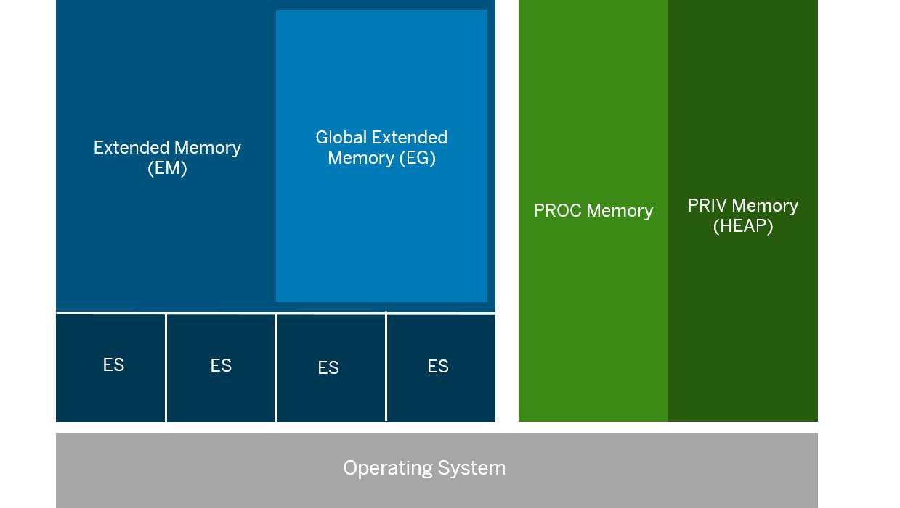

# SAP Memory Management
SAP Learning material to understand Memory Management

# AUTHOR: Jeffery Sole
# Date: 05/12/23
# Description: Kochasoft Memory Types & Memory Management Learning Package

# Table of Contents
[Introduction to Memory Management](#Introduction)

[SAP Shared Memory](#Shared-Memory)

[Extended Segments Memory](#extended-segments-memory)

[Extended Memory](#Extended-Memory)

[Global Extended Memory](#Global-Extended-Memory)

[PRIV Memory (HEAP)](#priv-memory)

# Introduction

SAP Memory Management has several types of memory which can be allocated differently. This allocation is determined by the systems OS type, work process type, as well as the systems configuration.

As memory is one of the main contributors to SAP system issues, it is important to understand each type of memory area, how they are used, and what can go wrong internally if not monitored carefully. We will break down each memory area and how they can be used to SAP's advantage.

These are the following memory areas SAP has:

| Memory Type | Physical Assignment | Lifetime | Address Stability  | User-Specific |
|---|---|---|---|---|
| SAP Shared Memory (SHM) | All work processes | ABAP Instance | No | No |
| Extended Segments Memory (ES) | All work processes | ABAP Transactions | Yes | - |
| Extended Memory (EM) | All work processes | ABAP Transactions | Yes | Yes |
| Global Extended Memory (EG) | All work processes | ABAP instance | Yes | No |
| PRIV Memory (HEAP) | Process-specific | ABAP transactions | Yes | Yes |
| PROC Memory | Process-specific | ABAP instance | Yes | No |

We can see the management and separation of SAP's memory in the image below



# Shared Memory

SAP Shared memory is a shared memory resource in SAP Memory Management where various buffer data is stored.

SAP Shared memory provides a shared memory pool which gets shared by all work processes and is based directly on the shared memory of the OS.

**Local** SAP SHM segments can be used by all work processes of one AS instance.

**Global** SAP SHM segments can be used by all work process of all AS instances running on the same host.

SAP SHM segments are separated in one of two ways:
* Allocated to a shared memory segment in the OS
* Managed in shared memory pools (SHM Pools)

What exactly is a shared memory pool?
* It is a shared memory segment in the OS that contains multiple SAP SHM segments
* Pool management of SAP SHM can be useful if the number of SAP SHM segments is limited by the OS
* The size of the shared memory pools is defined in the following parameter: 

```ipc/shm_psize_<xx>```

For a work process to be able to allocate SAP shared memory, an SAP SHM segment has to be **CREATED**. An area is reserved for this in physcial memory. Next, an SAP SHM segment can be assigned to a work process, in this step, the address is returend to the work process which it can use to access the SAP SHM segment.

# Extended Segments Memory

SAP Extended Segments Memory (ES) forms the basis for extended memory and global extended memory (EM and EG)

The ES consists of a set number of segments located next to each other which can be accessed by all work processes of an AS instance

An ES segment consists of one or more ES blocks that are all the same size
* The size of these blocks is configured in the profile parameter ```em/blocksize_KB```

    * It's default value is 4 MB

The ES blocks are stored in specific shared memory segments in the OS where the segments are exclusively reserved for ES memory. ES and EM memory are implemented depending on the OS

# Extended Memory

Extended memory will contain user specific rdata that all work process will have access to. This will help optimize our system for when user context switches are performed.

EM is the core of SAP Memory Management which contains majority of the data for a user session

The size of the EM area is set in the profile parameter:

`em/initial_size_MB`

SAP Memory Management has the task of allocating memory areas from different memory types to a user session to enable work processes to execute ABAP programs

The squence in which work processes allocate memory areas from the EM depends on both the work process type:

* Dialog
* Non-Dialog

And the underlying operating system

**Dialog**

Work processes first allocate **EM** to ensure a fast user context switch. Once the quota for EM has been reached (ztta/roll_extension_dia), the work process allocates PRIV memory (HEAP). The work process is allocated to a specific user session and is not available to other user contexts.

**Non-Dialog**

Work processes first allocate PRIV (heap) memory. Once the quota for PRIV memory is reached, the work processes allocate EM, since no fast user context is required with this work processes type.

**Implementation Models**
* Flat implementation
* Map implementation
* ESSHM implementation

# Global Extended Memory

The global extended memory (EG) is part of the extended memory (EM). Containing user-specific data and is able to be accessed by all work processes.

Global Extended Memory is part of the Extended Memory and is used specifically for multiprocessing. It contains data that does not belong to a specific user session. This may be data used for monitoring and statistics, or table buffers of the databse interface (DBI), or ABAP shared objects that all work processes have access to independently of the user session.

EG is sized using the profile parameter:

```em/global_area_MB```

# PRIV Memory

Also known as heap memory - PRIV memory contains data from the user context and is bound to a work process within a user session that is being executed.
When a work process allocates PRIV memory, it cannot process any other user context.

When memory areas are allocated from the PRIV memory pool, the work process is reserved for processing the current user context until the context releases the work process after the user ends their session.

* At this time, no other user context can be mapped to the work process

PRIV memory size can be specified using the profile parameter

```abap/heap_area_total```

Once PRIV memory has been allocated, the work process runs in PRIV mode.

PRIV mode prevents the user context from being unmapped from the work process

Exmaple: When a user becomes inactive.

* This use of the PRIV memory leads to an exclusive occupancy of the dialog work process by the user and prevents (up until the end of the transaction currently running) the work process from processing another user context. Neither can the user context currently in the occupuied work process be processed by another work process.

A Dialog Work Process allocates PRIV memory if the quota for extended memory (EM) is exceeded for a user session, or in exceptional cases if the extended memory (EM) is fully used up.

The Non-Dialog work processes (backgorund, update, spool) allocate PRIV memory at the start of the request processing. This is because no faster user context is required for these work process types.